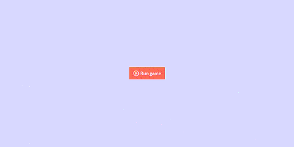

# Unity WebGL plugin to display progress of assets loading in the browser based on downloaded bytes.

#### This plugin is designed to provide a visual indication of the loading progress of assets in a Unity WebGL build. It overrides the default loading behavior to display a progress bar in the browser, allowing users to see how much of the assets have been loaded.

I wrote it as the progress bar in the default Unity WebGL template is buggy for me when the data is Brotli/Gzip compressed.

Tested on Unity 6000.3.9.

### How to use

- Import these files into your Unity project
- Set this template as your WebGL template in the Player Settings
- Update tracked file variable in the script to match the file you want to track (by default it will only track "data" and "wasm" bundles). Update the messages you want to display to the users while loading.
- Build your project for WebGL

### How it works

This script override the JS window.fetch function to track the progress of loading assets `Assets/WebGLTemplates/Progress/resources-loading-tracker.js`. 

It uses a simple progress bar that is updated based on the amount of data loaded compared to the total size of the tracked file. The progress bar is displayed in the browser while the assets are being loaded, giving users a visual indication of the loading process.

When the app starts, it send a message to the browser to hide the progress bar (`Assets/Scripts/WebGLBridge.cs` and `Assets/Plugins/WebGLBridge.jslib`).

